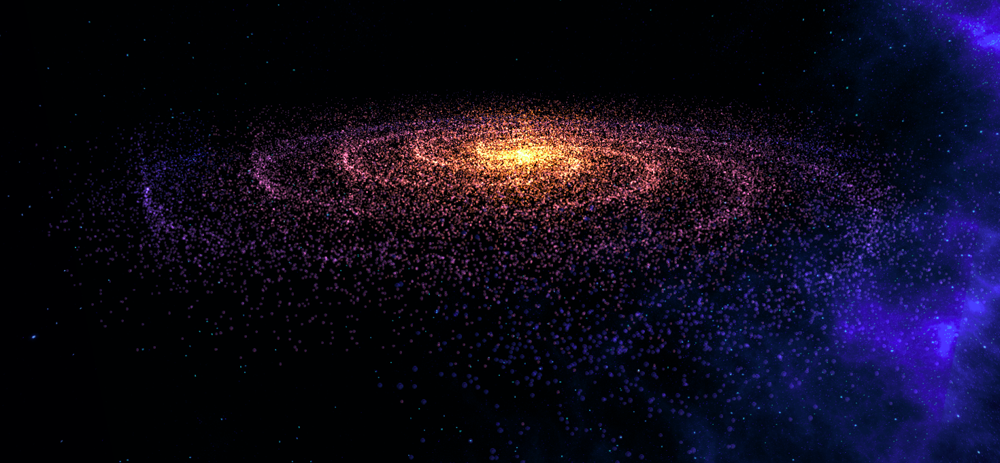

# NebulaCraft 🌌✨

Welcome to NebulaCraft, your interactive WebGL galaxy generator! Craft and explore mesmerizing galaxies with just a few clicks. 🚀✨

## 🌐 [Check it out live &rarr;](https://nebulacraft.vercel.app/)

## Features 🌟

- **Interactive Galaxy Generation:** Customize parameters to create unique and stunning galaxies.
- **Real-time Rendering:** See the changes instantly as you tweak the settings.
- **Orbit Controls:** Explore your crafted galaxies from different angles with ease.
- **Restore Defaults:** Quickly revert to the default settings for a fresh start.

## License 📝

This project is licensed under the [GPL-3.0 License](LICENSE) 📜.

## Acknowledgements 🙏

- Thanks to the Three.js community for providing a powerful and versatile 3D graphics library. 👏
- Hat tip to the creators of lil-gui for making such an awesome tool. 🎩

---
